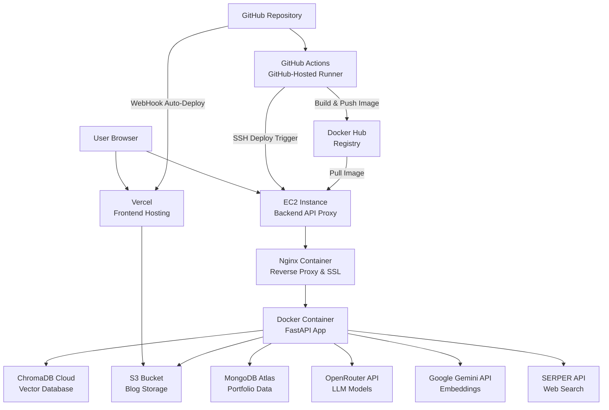
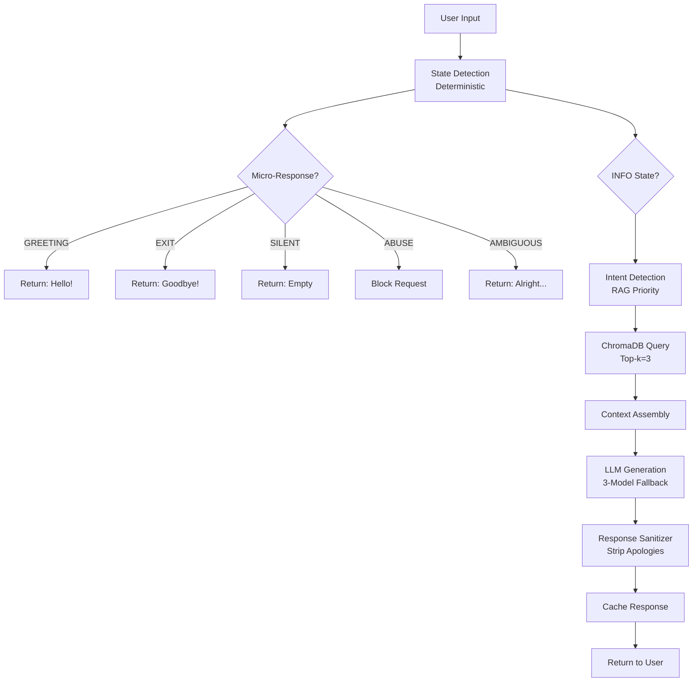
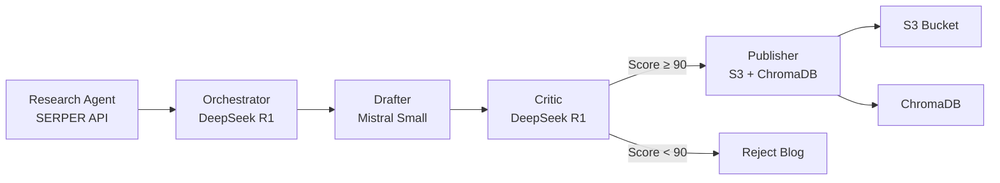
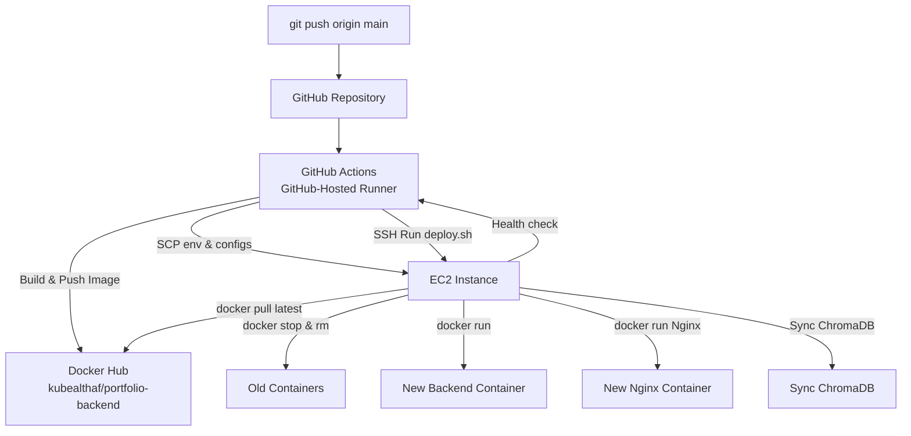
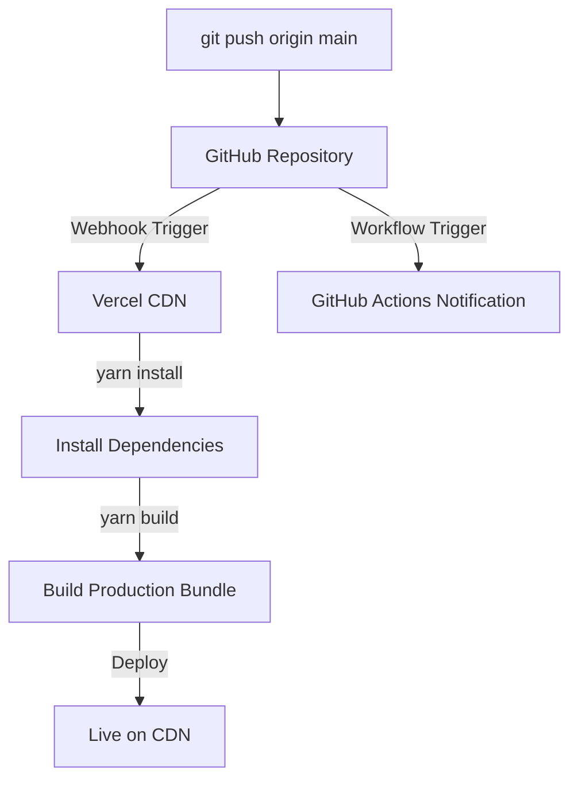
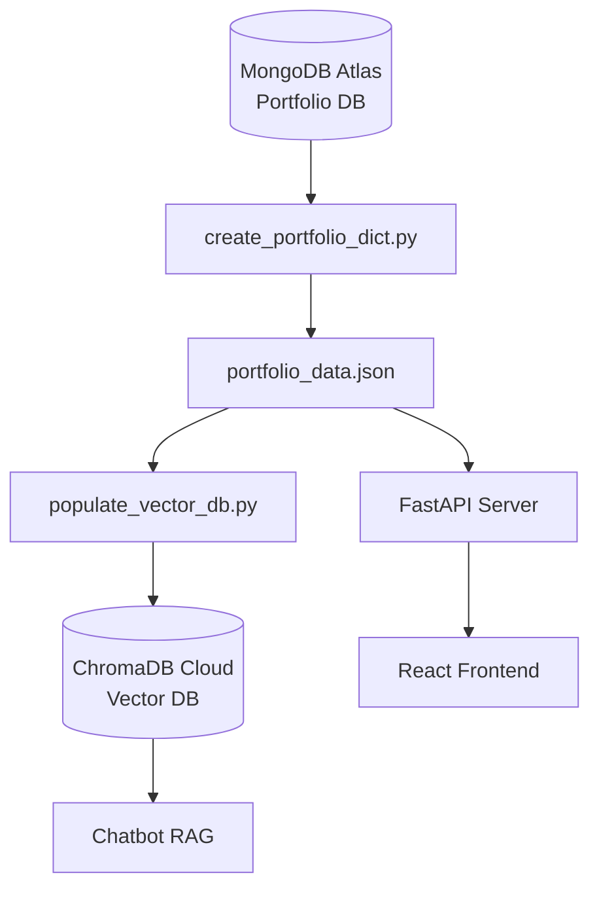
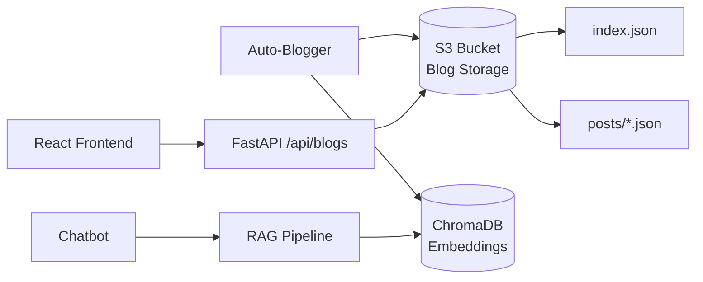

# Portfolio Application - System Architecture Documentation


**Last Updated:** January 1, 2026  

**Version:** 2.0  

**Status:** Production


---


## 📋 Table of Contents


1. [System Overview](#system-overview)

2. [Frontend Architecture](#frontend-architecture)

3. [Backend Architecture](#backend-architecture)

4. [EC2 Instance Structure](#ec2-instance-structure)

5. [Chatbot System](#chatbot-system)

6. [Auto-Blogger System](#auto-blogger-system)

7. [CI/CD Pipeline](#cicd-pipeline)

8. [File Classification](#file-classification)

9. [Environment Variables](#environment-variables)

10. [Troubleshooting](#troubleshooting)


---


## 1. System Overview


### Technology Stack


**Frontend:**

- React 18

- React Router v6

- Context API (Theme Management)

- Shadcn/UI Component Library

- CSS Modules

- Deployed on: **Vercel**


**Backend:**

- FastAPI (Python 3.11)

- Uvicorn ASGI Server

- Docker Containerization

- ChromaDB (Vector Database)

- AWS S3 (Blog Storage)

- MongoDB (Portfolio Data)

- Deployed on: **AWS EC2 (t2.large)**


**Infrastructure:**

- GitHub Actions (CI/CD)

- GitHub-Hosted Runner (for build/push/deploy trigger)

- Docker (Backend Containerization)

- Vercel (Frontend Hosting)


### High-Level Architecture





---


## 2. Frontend Architecture


### Technologies


| Technology | Version | Purpose |

|------------|---------|---------|

| React | 18.x | UI Framework |

| React Router | 6.x | Client-side routing |

| Context API | Built-in | Theme management |

| Shadcn/UI | Latest | Component library |

| CSS Modules | Built-in | Scoped styling |


### Deployment


**Platform:** Vercel  

**Build Command:** `yarn build`  

**Build Directory:** `build/`  

**Auto-Deploy:** On push to `main` branch (frontend changes)


**Deployment Integration:**

Vercel is directly integrated with the GitHub repository via webhooks. Any push to the `main` branch automatically triggers a high-performance build and deployment on Vercel, serverless CDN propagation, and instant updates without requiring manual pipeline maintenance.


### File Structure


```

frontend/

├── public/

│   ├── index.html

│   ├── manifest.json

│   ├── typing-sound.mp3

│   └── (static assets)

│

├── src/

│   ├── components/

│   │   ├── Portfolio.js          # Main portfolio component

│   │   ├── Chatbot.jsx            # Chatbot UI

│   │   ├── CustomLinkedInCard.jsx # LinkedIn badge

│   │   ├── IntroductionVideo.jsx  # Hero video

│   │   ├── HeroSection.js

│   │   ├── AboutSection.js

│   │   ├── SkillsSection.js

│   │   ├── ExperienceSection.js

│   │   ├── ProjectsSection.js

│   │   ├── BlogsSection.js

│   │   ├── CertificationsSection.js

│   │   ├── ContactSection.js

│   │   ├── Header.js

│   │   ├── Footer.js

│   │   ├── BlogDetailPage.js

│   │   ├── ProjectDetailPage.js

│   │   └── ui/                    # Shadcn/UI components (46 files)

│   │

│   ├── context/

│   │   └── ThemeContext.js        # Dark/Light theme

│   │

│   ├── hooks/

│   │   └── use-toast.js

│   │

│   ├── lib/

│   │   └── utils.js

│   │

│   ├── App.js                     # Main app component

│   ├── index.js                   # Entry point

│   └── smooth-scroll.js

│

└── package.json

```


### Active vs Unused Files


**✅ Active Files (26):**

- All section components (Hero, About, Skills, Experience, Projects, Blogs, Contact)

- `Chatbot.jsx` - Chatbot interface

- `CustomLinkedInCard.jsx` - Custom LinkedIn badge

- `IntroductionVideo.jsx` - Hero video component

- `Portfolio.js` - Main portfolio wrapper

- `App.js` - Application root

- `ThemeContext.js` - Theme management

- All `ui/` components (Shadcn/UI library - 46 files)


**❌ Unused/Deprecated (3):**

- `BlogsSection_new.js` - Old version, replaced

- `BlogForm.js` - Not used in production

- `data/mock.js` - Test data only


---


## 3. Backend Architecture


### Technologies


| Technology | Version | Purpose |

|------------|---------|---------|

| FastAPI | 0.104+ | Web framework |

| Uvicorn | 0.24+ | ASGI server |

| Python | 3.11 | Runtime |

| Docker | 24+ | Containerization |

| ChromaDB | 0.4+ | Vector database |

| Boto3 | 1.28+ | AWS S3 client |

| PyMongo | 4.5+ | MongoDB client |


### Deployment


**Platform:** AWS EC2 (t2.large)  

**Container:** Docker  

**Port:** 8000  

**Memory Limit:** 5GB  

**Restart Policy:** Always  

**Auto-Deploy:** On push to `main` branch (backend changes)


**Docker Configuration:**

```dockerfile

FROM python:3.11-slim

WORKDIR /app

RUN apt-get update && apt-get install -y build-essential curl

COPY requirements.txt .

RUN pip install --no-cache-dir -r requirements.txt

COPY . backend/

ENV PYTHONPATH=/app

WORKDIR /app/backend

EXPOSE 8000

CMD ["uvicorn", "server:app", "--host", "0.0.0.0", "--port", "8000"]

```


### File Structure


```

backend/

├── server.py                      # Main FastAPI application

├── chatbot_provider.py            # Chatbot logic & state machine

├── ai_service.py                  # LLM integration

├── cache_manager.py               # Response caching

├── rate_limiter.py                # API rate limiting

├── notification_service.py        # Email notifications

│

├── middleware/

│   └── response_sanitizer.py      # Response cleaning

│

├── auto_blogger/

│   ├── scheduler.py               # Blog scheduling

│   ├── writer.py                  # Blog generation (4-agent system)

│   ├── critic.py                  # Quality validation

│   ├── publisher.py               # S3 publishing

│   ├── researcher.py              # SERPER research

│   ├── job_state.py               # Job management

│   ├── logger_utils.py            # Logging utilities

│   ├── notifier.py                # Email notifications

│   ├── cleanup.py                 # Job cleanup

│   ├── watchdog.py                # Process monitoring

│   ├── worker.py                  # Background worker

│   └── models/

│       ├── model_config.py        # Model definitions

│       └── model_benchmarker.py   # Model testing

│

├── templates/

│   └── feedback.md                # Critic evaluation criteria

│

├── populate_vector_db.py          # ChromaDB population

├── verify_chroma_state.py         # DB verification

├── rebuild_s3_index.py            # S3 index rebuild

├── fix_todays_blog.py             # Blog patching

├── fetch_free_models.py           # Model discovery

├── check_credits.py               # OpenRouter credits

├── debug_retrieval.py             # RAG debugging

├── test_rag_pipeline.py           # RAG testing

├── test_chatbot_fixes.py          # Chatbot testing

├── create_portfolio_dict.py       # Data formatting

│

├── requirements.txt

└── Dockerfile

```


### Active vs Unused Files


**✅ Core Active Files (25):**


**API Layer (7):**

1. `server.py` - Main FastAPI app, endpoints

2. `chatbot_provider.py` - Chatbot state machine & logic

3. `ai_service.py` - LLM integration (Gemini, OpenRouter)

4. `cache_manager.py` - Response caching

5. `rate_limiter.py` - Rate limiting (10 req/min)

6. `notification_service.py` - Email via Resend

7. `middleware/response_sanitizer.py` - Apology stripping


**Auto-Blogger (13):**

8. `auto_blogger/scheduler.py` - Cron scheduler (7:00 AM daily)

9. `auto_blogger/writer.py` - 4-agent blog generation

10. `auto_blogger/critic.py` - Quality validation (score ≥90)

11. `auto_blogger/publisher.py` - S3 + ChromaDB publishing

12. `auto_blogger/researcher.py` - SERPER API research

13. `auto_blogger/job_state.py` - Resumable job management

14. `auto_blogger/logger_utils.py` - Structured logging

15. `auto_blogger/notifier.py` - Email notifications

16. `auto_blogger/cleanup.py` - Old job cleanup

17. `auto_blogger/watchdog.py` - Process health monitoring

18. `auto_blogger/worker.py` - Background task worker

19. `auto_blogger/models/model_config.py` - Agent model definitions

20. `auto_blogger/models/model_benchmarker.py` - Model performance testing


**Utilities (5):**

21. `populate_vector_db.py` - Sync portfolio data to ChromaDB

22. `verify_chroma_state.py` - Verify DB state

23. `rebuild_s3_index.py` - Rebuild blog index

24. `fix_todays_blog.py` - Quick blog patching

25. `fetch_free_models.py` - Discover free OpenRouter models


**❌ Deprecated/Unused Scripts (60+):**


**Old Deployment Scripts (15):**

- `deploy_hotfix.py`

- `deploy_model_fix.py`

- `deploy_notification_fix.py`

- `deploy_safe_models.py`

- `deploy_scheduler_override.py`

- (10 more `deploy_*.py` files)


**One-Time Fix Scripts (30):**

- `fix_all_blogs.py`

- `fix_blog_formatting.py`

- `blog_generator_fix.py`

- `complete_blog_fix.py`

- `final_markdown_cleanup.py`

- `clean_duplicates.py`

- `clean_phantom_blogs.py`

- (23 more `fix_*.py` and `clean_*.py` files)


**Unused Modules (15):**

- `analytics/analyze_logs.py` - Not in use

- `ci/check_rag_limits.py` - Old CI script

- `agent_service.py` - Deprecated

- `chat_endpoint.py` - Merged into server.py

- `direct_blog_generator.py` - Replaced by auto_blogger

- (10 more unused files)


---


## 4. EC2 Instance Structure


### Instance Details


**Instance Type:** t2.large  

**OS:** Amazon Linux 2  

**IP:** 13.233.54.210  

**SSH Key:** `PORTFOLIO.pem`  

**Region:** ap-south-1 (Mumbai)


### Directory Layout


```

/home/ec2-user/

│

├── portfolio/                          # Git repository (synced)

│   ├── backend/                        # Backend code

│   │   ├── server.py

│   │   ├── chatbot_provider.py

│   │   ├── auto_blogger/

│   │   └── (all backend files)

│   │

│   ├── frontend/                       # Frontend code (not used on EC2)

│   │   └── (React app - deployed to Vercel)

│   │

│   ├── .git/                           # Git metadata

│   ├── .github/                        # GitHub Actions workflows

│   └── README.md

│

├── portfolio-logs/                     # Persistent logs (Docker volume)

│   ├── chatbot.log                     # Chatbot request/response logs

│   │                                   # Size: ~8KB, rotates daily

│   │

│   └── auto_blogger/                   # Auto-blogger job logs

│       ├── DevOps-2026-01-01-070005/   # Job directory (format: {category}-{date}-{id})

│       │   ├── job_metadata.json       # Job status, timestamps

│       │   ├── 00_Introduction_*.log   # Section generation logs

│       │   ├── 01_Core_Concept_*.log

│       │   ├── 02_Technical_*.log

│       │   └── (other section logs)

│       │

│       ├── DevOps-2025-12-30-070005/   # Previous job

│       └── (other job directories)

│

└── actions-runner/                      # Self-hosted GitHub Actions runner

    ├── _work/                          # Workspace (742MB)

    ├── _diag/                          # Diagnostics (auto-cleanup at 7GB)

    ├── bin.2.330.0/                    # Runner binaries (79MB)

    ├── externals.2.330.0/              # External dependencies (583MB)

    ├── config.sh                       # Runner configuration

    ├── svc.sh                          # Service management script

    └── .credentials                    # GitHub authentication (PAT)

```


### Docker Container


**Container Name:** `portfolio-backend`  

**Image:** `portfolio-backend:latest`  

**Status:** Running (auto-restart)


**Volume Mounts:**

```bash

/home/ec2-user/portfolio-logs:/app/backend/logs

```


**Environment File:**

```bash

/home/ec2-user/portfolio/backend/.env.local

```


**Container Inspection:**

```bash

# View logs

docker logs portfolio-backend --tail 100


# Check status

docker ps | grep portfolio-backend


# Execute commands

docker exec -it portfolio-backend bash


# View environment

docker exec portfolio-backend env | grep -E "MONGO|GEMINI|CHROMA"

```


### Log File Locations


**Chatbot Logs:**

```

Host: /home/ec2-user/portfolio-logs/chatbot.log

Container: /app/backend/logs/chatbot.log

Format: Timestamped request/response pairs

Rotation: Daily (max 7 days)

```


**Auto-Blogger Logs:**

```

Host: /home/ec2-user/portfolio-logs/auto_blogger/{job_id}/

Container: /app/backend/logs/auto_blogger/{job_id}/

Structure:

  - job_metadata.json (status, timestamps)

  - 00_Introduction_*.log (section logs)

  - 01_Core_Concept_*.log

  - (one log per section)

```


**System Logs:**

```

Docker: journalctl -u docker

Runner: /home/ec2-user/actions-runner/_diag/

Runner Service: sudo systemctl status actions.runner.ALTHAFHUSSAINSYED-portfolio.portfolio.service

```


**Disk Space Management:**

```bash

# Check disk usage

df -h /


# Clean Docker cache (frees ~15GB)

docker builder prune -af

docker image prune -af


# Clean runner diagnostics (frees ~7GB when full)

rm -rf /home/ec2-user/actions-runner/_diag/*


# Clean system logs (frees ~300MB)

sudo journalctl --vacuum-size=50M

```


---


## 5. Chatbot System


### Architecture Overview





### State Machine


**States:**

1. **GREETING** - "hi", "hello", "hey" → Micro-response

2. **EXIT** - "bye", "goodbye", "quit" → Micro-response

3. **SILENT** - "ok", "cool", "hmm" → Empty response

4. **ABUSE** - Profanity detected → Block request

5. **AMBIGUOUS** - "what?", "really?" → Micro-response

6. **INFO** - Default → RAG pipeline


**Code:**

```python

def detect_conversation_state(self, text: str) -> str:

    t = text.lower().strip()

    

    # 1. ABUSE (whole word match)

    profanity = {"fuck", "shit", "bitch", "stupid", "idiot"}

    if any(w in words for w in profanity):

        return "ABUSE"

    

    # 2. EXIT

    exit_phrases = ["bye", "goodbye", "exit", "quit"]

    if t in exit_phrases:

        return "EXIT"

    

    # 3. GREETING

    greetings = ["hi", "hello", "hey", "yo"]

    if t in greetings:

        return "GREETING"

    

    # 4. SILENT (filler words)

    fillers = ["ok", "okay", "cool", "hmm"]

    if t in fillers:

        return "SILENT"

    

    # 5. DEFAULT → INFO

    return "INFO"

```


### Model Fallback Chain


| Priority | Model | Provider | Purpose |

|----------|-------|----------|---------|

| **Primary** | `google/gemini-2.0-flash-exp:free` | OpenRouter | Main chatbot model |

| **Fallback 1** | `meta-llama/llama-3.2-3b-instruct` | Hugging Face | If OpenRouter fails |

| **Tier 3 (Emergency)** | `gemini-2.5-flash` | Google AI | Last resort fallback |


**Code:**

```python

# Tier 1: Mistral 7B (Primary - OpenRouter)

response = requests.post(

    "https://openrouter.ai/api/v1/chat/completions",

    headers={"Authorization": f"Bearer {CHATBOT_NEW_KEY}"},

    json={

        "model": "mistralai/mistral-7b-instruct:free",

        "messages": messages

    }

)


# Tier 2: Hugging Face Gradio (Fallback)

if not response.ok:

    hf_client = Client("huggingface-projects/llama-3.2-3B-Instruct")

    response = hf_client.predict(message=prompt)


# Tier 3: Gemini 2.5 Flash (Emergency)

if not response:

    gemini_client = genai.Client(api_key=GEMINI_API_KEY)

    response = gemini_client.models.generate_content(

        model="gemini-2.5-flash",

        contents=prompt

    )

```


### RAG Pipeline


**Step 1: Intent Detection**

```python

def detect_intent_priority(message: str) -> str:

    keywords = {

        "projects": ["project", "built", "created", "developed"],

        "experience": ["experience", "worked", "job", "role"],

        "skills": ["skill", "technology", "proficient"],

        "blogs": ["blog", "article", "wrote"],

        "conversation": ["how are you", "what's up"]

    }

    # Returns: "projects", "experience", "skills", "blogs", or "conversation"

```


**Step 2: ChromaDB Retrieval**

```python

# Query ChromaDB

collection = chroma_client.get_collection("portfolio")

results = collection.query(

    query_texts=[message],

    n_results=3,  # Top-3 retrieval

    include=["documents", "metadatas"]

)

```


**Step 3: Context Assembly**

```python

context = "\n\n".join([

    f"Source: {meta['title']}\n{doc}"

    for doc, meta in zip(results['documents'], results['metadatas'])

])

```


**Step 4: LLM Generation**

```python

prompt = f"""

You are Althaf's portfolio assistant.


CONTEXT:

{context}


USER QUESTION:

{message}


RULES:

- Answer based on context only

- Be concise (2-3 sentences)

- No apologies or disclaimers

"""

```


### ChromaDB Integration


**Collections:**

| Collection | Items | Embedding Model | Purpose |

|------------|-------|-----------------|---------|

| `portfolio` | 3 | `text-embedding-004` | Portfolio sections |

| `Blogs_data` | 1 | `text-embedding-004` | Published blogs |

| `experience` | N/A | `text-embedding-004` | Work experience |


**Connection:**

```python

chroma_client = chromadb.CloudClient(

    api_key=CHROMA_API_KEY,

    tenant=CHROMA_TENANT_ID,

    database="Development"

)

```


**Query Example:**

```python

collection = chroma_client.get_collection("Blogs_data")

results = collection.query(

    query_texts=["DevOps best practices"],

    n_results=3

)

# Returns: Top 3 blog excerpts with metadata

```


### S3 Blog Integration


**Bucket:** `s3://althaf-blogs-storage/blogs/`


**Structure:**

```

blogs/

├── index.json              # Blog metadata (lightweight)

│   └── {id, title, category, excerpt, created_at, tags, author}

│

└── posts/

    ├── DevOps_1767241800.json      # Full blog content

    ├── Cybersecurity_1766919159.json

    └── (other blogs)

```


**Query Flow:**

```python

# 1. Fetch index

s3 = boto3.client('s3')

index = s3.get_object(Bucket='althaf-blogs-storage', Key='blogs/index.json')

blogs = json.loads(index['Body'].read())['blogs']


# 2. Filter by category

devops_blogs = [b for b in blogs if b['category'] == 'DevOps']


# 3. Fetch full content if needed

blog = s3.get_object(Bucket='althaf-blogs-storage', Key=f'blogs/posts/{blog_id}.json')

content = json.loads(blog['Body'].read())

```


### Safety Gates


**1. Sentiment Analysis**

```python

if detect_conversation_state(message) == "ABUSE":

    return {"response": "I can't continue if language stays disrespectful."}

```


**2. Rate Limiting**

```python

# 10 requests per minute per IP

@app.post("/api/chatbot")

@limiter.limit("10/minute")

async def ask_all_u_bot(request: Request):

    ...

```


**3. Response Sanitizer**

```python

# Strip apology boilerplate

APOLOGY_PATTERNS = [

    r"\bi may not have\b",

    r"\bi apologize\b",

    r"\bsorry\b",

    r"\bi don't have real-time capabilities\b"

]


def strip_apology_boilerplate(text: str) -> str:

    for pattern in APOLOGY_PATTERNS:

        text = re.sub(pattern, "", text, flags=re.IGNORECASE)

    return text.strip()

```


**4. Cache Deduplication**

```python

# MD5 hash of query

cache_key = hashlib.md5(message.encode()).hexdigest()

if cache_key in cache:

    return cache[cache_key]

```


**5. Deterministic Date Handling**

```python

# Date queries bypass LLM

date_keywords = ["date", "today", "when", "current date"]

if any(keyword in message.lower() for keyword in date_keywords):

    from datetime import datetime

    return f"Today is {datetime.now().strftime('%B %d, %Y')}."

```


---


## 6. Auto-Blogger System


### 4-Agent Architecture





### Agent Models


| Agent | Primary Model | Fallback Model | Max Tokens | Temp | Role |

|-------|---------------|----------------|------------|------|------|

| **Orchestrator** | `deepseek/deepseek-r1-0528:free` | `tngtech/deepseek-r1t-chimera:free` | 2000 | 0.6 | Outline generation |

| **Drafter** | `mistralai/mistral-small-3.1-24b-instruct:free` | `meta-llama/llama-3.2-3b-instruct:free` | 1500 | 0.7 | Section writing |

| **Critic** | `deepseek/deepseek-r1-0528:free` | `z-ai/glm-4.5-air:free` | 1000 | 0.3 | Quality validation |

| **Polisher** | `mistralai/mistral-small-3.1-24b-instruct:free` | `meta-llama/llama-3.2-3b-instruct:free` | 1000 | 0.6 | Final polish (unused) |


**All models are FREE tier via OpenRouter API**


### Workflow


**Step 1: Research (SERPER API)**

```python

# Query Google for trends

query = f"latest {category} trends 2026 technology breakthroughs"

response = requests.post(

    "https://google.serper.dev/search",

    headers={"X-API-KEY": SERPER_API_KEY},

    json={"q": query, "num": 5, "tbs": "qdr:w"}  # Past week

)


# Extract headlines and snippets

research_data = {

    "headlines": [item['title'] for item in response['organic']],

    "key_insights": [item['snippet'] for item in response['organic']],

    "sources": response['organic']

}

```


**Step 2: Outline Generation (Orchestrator)**

```python

prompt = f"""

You are an elite technical blog architect.

Topic: {category}


RESEARCH SUMMARY:

{json.dumps(research_data, indent=2)}


CRITICAL TITLE REQUIREMENTS:

- Title MUST be unique and specific (NOT generic like "Technical Deep Dive")

- Include year (2026) or specific technologies

- Reflect CURRENT TRENDS from research


OUTPUT FORMAT (JSON):

{{

  "title": "Unique, specific title",

  "summary": "2-3 sentence preview",

  "sections": ["Introduction: ...", "Section 1: ...", "Conclusion"]

}}

"""


# Call DeepSeek R1

response = openrouter.chat.completions.create(

    model="deepseek/deepseek-r1-0528:free",

    messages=[{"role": "user", "content": prompt}],

    max_tokens=2000,

    temperature=0.6

)


outline = json.loads(response.choices[0].message.content)

```


**Step 3: Section Drafting (Drafter)**

```python

# Loop through sections (resumable)

for section in outline['sections']:

    prompt = f"""

    Write section: {section}

    

    Context: {outline}

    Research: {research_data}

    

    Requirements:

    - 300-500 words

    - Code examples where relevant

    - Technical accuracy

    - Engaging tone

    """

    

    # Call Mistral Small

    response = openrouter.chat.completions.create(

        model="mistralai/mistral-small-3.1-24b-instruct:free",

        messages=[{"role": "user", "content": prompt}],

        max_tokens=1500,

        temperature=0.7

    )

    

    section_content = response.choices[0].message.content

    

    # Save progress (resumable)

    job_mgr.save_section(job_id, section, section_content)

```


**Step 4: Quality Validation (Critic)**

```python

prompt = f"""

You are a strict editorial critic.

Evaluate this blog based on:

1. Technical Accuracy

2. Clarity and Flow

3. Engagement

4. SEO Optimization


BLOG DRAFT:

{blog_content}


OUTPUT FORMAT (JSON):

{{

  "score": 95,

  "verdict": "PASS",

  "strengths": ["...", "...", "..."],

  "weaknesses": ["...", "...", "..."],

  "reasoning": "..."

}}

"""


# Call DeepSeek R1

response = openrouter.chat.completions.create(

    model="deepseek/deepseek-r1-0528:free",

    messages=[{"role": "user", "content": prompt}],

    max_tokens=1000,

    temperature=0.3

)


result = json.loads(response.choices[0].message.content)


# Pass threshold: Score ≥ 90

if result['score'] >= 90 or result['verdict'] == "PASS":

    proceed_to_publish()

else:

    reject_blog()

```


**Step 5: Publishing (S3 + ChromaDB)**

```python

# 1. Strip leaked instructions

blog['content'] = strip_leaked_instructions(blog['content'])


# 2. Upload to S3

s3.put_object(

    Bucket='althaf-blogs-storage',

    Key=f'blogs/posts/{blog_id}.json',

    Body=json.dumps(blog, indent=2),

    ContentType='application/json'

)


# 3. Update index

index_data = s3.get_object(Bucket='althaf-blogs-storage', Key='blogs/index.json')

blogs = json.loads(index_data['Body'].read())

blogs['blogs'].insert(0, {

    "id": blog_id,

    "title": blog['title'],

    "excerpt": create_clean_excerpt(blog['content']),  # Markdown-free

    "created_at": blog['created_at'],

    "category": blog['category'],

    "tags": blog['tags']

})

s3.put_object(Bucket='althaf-blogs-storage', Key='blogs/index.json', Body=json.dumps(blogs))


# 4. Embed in ChromaDB

embedding = gemini_client.models.embed_content(

    model="text-embedding-004",

    contents=blog['content']

)

collection.upsert(

    ids=[blog_id],

    documents=[blog['content']],

    embeddings=[embedding.embeddings[0].values],

    metadatas=[{"title": blog['title'], "category": blog['category']}]

)

```


### Quality Gates


**1. SEO Instruction Stripping**

```python

def strip_leaked_instructions(content: str) -> str:

    # Remove "SEO Implementation" sections

    content = re.sub(

        r'####?\s*SEO Implementation.*?(?=\n##|\Z)',

        '', content, flags=re.DOTALL | re.IGNORECASE

    )

    return content.strip()

```


**2. Clean Excerpt Generation**

```python

def create_clean_excerpt(content: str, max_length: int = 200) -> str:

    # Strip markdown headers, links, code blocks

    clean = re.sub(r'^#+\s+', '', content, flags=re.MULTILINE)

    clean = re.sub(r'\[([^\]]+)\]\([^\)]+\)', r'\1', clean)

    clean = re.sub(r'```.*?```', '', clean, flags=re.DOTALL)

    

    # Get first paragraph

    paragraphs = [p.strip() for p in clean.split('\n\n') if p.strip()]

    excerpt = paragraphs[0] if paragraphs else clean

    

    # Truncate at word boundary

    if len(excerpt) > max_length:

        excerpt = excerpt[:max_length].rsplit(' ', 1)[0] + '...'

    

    return excerpt

```


**3. Content Validation**

```python

# Reject if contains failure tokens

failed_indicators = [

    '<<SECTION_GENERATION_FAILED>>',

    '[Content Generation Failed',

]


if any(indicator in content for indicator in failed_indicators):

    raise ValueError("Blog contains failed sections - REJECT")


# Reject if too short

if len(content) < 1000:

    raise ValueError("Blog too short - REJECT")

```


### Scheduler


**Cron Schedule:** Daily at 7:00 AM IST


```python

# In scheduler.py

def run_scheduler():

    schedule.every().day.at("07:00").do(generate_daily_blog)

    

    while True:

        schedule.run_pending()

        time.sleep(60)


def generate_daily_blog():

    categories = ["DevOps", "Cloud Computing", "Cybersecurity", "AI/ML"]

    category = categories[get_next_index()]

    

    # Research → Outline → Draft → Validate → Publish

    researcher = BlogResearcher()

    research_data = researcher.analyze_trends(category)

    

    writer = BlogWriter()

    blog = writer.generate_blog(category, research_data)

    

    critic = BlogCritic()

    passed, feedback = critic.evaluate(blog['content'], category)

    

    if passed:

        publisher = BlogPublisher()

        url = publisher.publish(blog)

        logger.info(f"✅ Published: {url}")

    else:

        logger.warning(f"❌ Rejected: {feedback}")

```


### Job State Management


**Resumable Jobs:**

```python

# Save job state

job_mgr.create_job(category)  # Creates job_id

job_mgr.save_outline(job_id, outline)

job_mgr.save_section(job_id, section_name, content)

job_mgr.update_status(job_id, "generated")


# Resume job

job = job_mgr.load_job(job_id)

if job['outline']:

    # Resume from drafting

    continue_drafting(job)

```


**Job Directory:**

```

/app/backend/logs/auto_blogger/{job_id}/

├── job_metadata.json           # Status, timestamps

├── 00_Introduction_*.log       # Section logs

├── 01_Core_Concept_*.log

└── (other section logs)

```


---


## 7. CI/CD Pipeline


### GitHub Actions & Deployment Workflows


**Location:** `.github/workflows/`


| Workflow | Trigger | Purpose | Runner |

|----------|---------|---------|--------|

| `deploy.yml` | Push to `main` (backend changes) | Builds backend Docker image, pushes to Docker Hub, and triggers deployment script on EC2 | github-hosted (ubuntu-latest) |

| `terraform.yml` | Push/PR to `main` (infra changes) | Automatically runs formatting, validate, plan, and applies Terraform updates (GitOps) | github-hosted (ubuntu-latest) |

| `ai-chatbot-gates.yml` | Push/PR (backend/tests changes) | Chatbot validation / testing | github-hosted (ubuntu-latest) |

| `repopulate-chromadb.yml` | Manual | Triggers ChromaDB population script inside backend container on EC2 | github-hosted (ubuntu-latest) |

| `frontend-deploy.yml` | Push to `main` (frontend changes) | Notifies when frontend changes are pushed (Vercel does the actual deploy) | github-hosted (ubuntu-latest) |


### Backend Deployment Flow


The backend deployment is orchestrated via GitHub Actions using a GitHub-hosted runner. It does not require a self-hosted runner on the EC2 instance. Instead, it uses SSH and SCP to deploy the application container.





**Workflow File (`deploy.yml`):**

```yaml

name: Deploy Backend App


on:

  push:

    paths:

      - 'backend/**'

  workflow_dispatch: # Allows manual trigger


jobs:

  build-and-deploy:

    runs-on: ubuntu-latest

    steps:

      - name: Checkout Code

        uses: actions/checkout@v4


      - name: Set up Docker Buildx

        uses: docker/setup-buildx-action@v3


      - name: Log in to Docker Hub

        uses: docker/login-action@v3

        with:

          username: ${{ secrets.DOCKERHUB_USERNAME }}

          password: ${{ secrets.DOCKERHUB_TOKEN }}


      - name: Build and Push Docker Image

        uses: docker/build-push-action@v5

        with:

          context: .

          file: ./backend/Dockerfile

          push: true

          tags: kubealthaf/portfolio-backend:latest

          cache-from: type=gha

          cache-to: type=gha,mode=max


      - name: Write Env and Nginx Configs

        run: |

          echo "${{ secrets.ENV_FILE_CONTENT }}" > .env.local

          cp infrastructure/terraform/nginx.conf nginx.conf


      - name: Transfer Configuration & Deploy Script to EC2

        uses: appleboy/scp-action@master

        with:

          host: ${{ secrets.EC2_HOST }}

          username: ec2-user

          key: ${{ secrets.EC2_SSH_KEY }}

          source: ".env.local,nginx.conf,infrastructure/terraform/deploy.sh"

          target: "/tmp"

          strip_components: 0


      - name: Run Deploy Script on EC2

        uses: appleboy/ssh-action@master

        with:

          host: ${{ secrets.EC2_HOST }}

          username: ec2-user

          key: ${{ secrets.EC2_SSH_KEY }}

          script: |

            chmod +x /tmp/infrastructure/terraform/deploy.sh

            /tmp/infrastructure/terraform/deploy.sh

            rm -rf /tmp/infrastructure /tmp/nginx.conf /tmp/.env.local

```


### Frontend Deployment Flow


The frontend deployment is fully automated via Vercel's Git integration. Vercel is connected directly to the GitHub repository and auto-deploys on every push to the `main` branch when changes are detected in the `frontend/` directory.





**Vercel Build Configuration (`Vercel.yml`):**

```yaml

version: 1

applications:

  - appRoot: frontend

    frontend:

      phases:

        preBuild:

          commands:

            - yarn install --ignore-engines

        build:

          commands:

            - yarn run build

      artifacts:

        baseDirectory: build

        files:

          - '**/*'

```


### Infrastructure Provisioning & GitOps (Terraform)


Infrastructure provisioning is managed as code (IaC) under `infrastructure/terraform/` and automated using the **`terraform.yml`** GitOps pipeline:

1. **Pull Requests**: Triggers validation, formatting checks, and `terraform plan` to dry-run changes.

2. **Push/Merge to `main`**: Runs validation and `terraform apply -auto-approve` to automatically align the AWS cloud environment state with your repository definitions.


State locking is enabled natively via S3 (since Terraform v1.10+) using `use_lockfile = true` in `backend.tf`. Sensitive keys/credentials (AWS Access Keys) must be configured in GitHub Actions Secrets to authenticate deployment tasks.


---


## 8. File Classification


### Backend Files (91 total)


**✅ Active (25 files):**


**Core API (7):**

- `server.py` - Main FastAPI app

- `chatbot_provider.py` - Chatbot logic

- `ai_service.py` - LLM integration

- `cache_manager.py` - Response caching

- `rate_limiter.py` - Rate limiting

- `notification_service.py` - Email service

- `middleware/response_sanitizer.py` - Response cleaning


**Auto-Blogger (13):**

- `auto_blogger/scheduler.py` - Daily scheduler

- `auto_blogger/writer.py` - Blog generation

- `auto_blogger/critic.py` - Quality validation

- `auto_blogger/publisher.py` - S3 publishing

- `auto_blogger/researcher.py` - SERPER research

- `auto_blogger/job_state.py` - Job management

- `auto_blogger/logger_utils.py` - Logging

- `auto_blogger/notifier.py` - Notifications

- `auto_blogger/cleanup.py` - Cleanup

- `auto_blogger/watchdog.py` - Monitoring

- `auto_blogger/worker.py` - Background tasks

- `auto_blogger/models/model_config.py` - Models

- `auto_blogger/models/model_benchmarker.py` - Testing


**Utilities (5):**

- `populate_vector_db.py` - ChromaDB sync

- `verify_chroma_state.py` - DB verification

- `rebuild_s3_index.py` - Index rebuild

- `fix_todays_blog.py` - Blog patching

- `fetch_free_models.py` - Model discovery


**❌ Deprecated (66 files):**


**Deployment Scripts (15):**

- `deploy_*.py` (all deployment scripts)


**Fix Scripts (30):**

- `fix_*.py` (one-time fixes)

- `clean_*.py` (data cleanup)

- `complete_*.py` (migration scripts)


**Unused Modules (21):**

- `analytics/` directory

- `ci/` directory

- `agent_service.py`

- `chat_endpoint.py`

- `direct_blog_generator.py`

- (16 more)


### Frontend Files (72 total)


**✅ Active (26 files):**


**Core Components (14):**

- `App.js` - Main app

- `Portfolio.js` - Portfolio wrapper

- `Chatbot.jsx` - Chatbot UI

- `CustomLinkedInCard.jsx` - LinkedIn badge

- `IntroductionVideo.jsx` - Hero video

- `HeroSection.js`

- `AboutSection.js`

- `SkillsSection.js`

- `ExperienceSection.js`

- `ProjectsSection.js`

- `BlogsSection.js`

- `CertificationsSection.js`

- `ContactSection.js`

- `Header.js`, `Footer.js`


**Routing (2):**

- `BlogDetailPage.js`

- `ProjectDetailPage.js`


**Context/Hooks (3):**

- `context/ThemeContext.js`

- `hooks/use-toast.js`

- `lib/utils.js`


**Entry (2):**

- `index.js`

- `smooth-scroll.js`


**Shadcn/UI (46):**

- All `components/ui/*.jsx` files (library components)


**❌ Unused (3 files):**

- `BlogsSection_new.js` - Old version

- `BlogForm.js` - Not in production

- `data/mock.js` - Test data


---


## 9. Environment Variables


**Backend (`.env.local`):**


| Variable | Purpose | Required |

|----------|---------|----------|

| `MONGO_URL` | MongoDB connection string | Yes |

| `GEMINI_API_KEY` | Google Gemini API key | Yes |

| `CHROMA_API_KEY` | ChromaDB Cloud API key | Yes |

| `CHROMA_TENANT_ID` | ChromaDB tenant ID | Yes |

| `CHROMA_DB_NAME` | ChromaDB database name | Yes |

| `CHATBOT_NEW_KEY` | OpenRouter API key (chatbot) | Yes |

| `BLOG_KEY` | OpenRouter API key (auto-blogger) | Yes |

| `SERPER_API_KEY` | SERPER search API key | Yes |

| `RESEND_KEY` | Resend email API key | Yes |

| `EMAIL_ADDRESS` | Notification email | Yes |

| `CLOUDINARY_CLOUD_NAME` | Cloudinary cloud name | No |

| `CLOUDINARY_API_KEY` | Cloudinary API key | No |

| `CLOUDINARY_API_SECRET` | Cloudinary API secret | No |

| `CORS_ORIGINS` | Allowed CORS origins | No |


**Frontend:**

- No environment variables (static build)


---


## 10. Troubleshooting


### Common Issues


**Issue 1: Chatbot Not Responding**


**Symptoms:**

- 500 error from `/api/chatbot`

- Empty response


**Diagnosis:**

```bash

# Check logs

ssh -i "PORTFOLIO.pem" ec2-user@13.233.54.210

docker logs portfolio-backend --tail 100 | grep -i error


# Check ChromaDB connection

docker exec portfolio-backend python -c "import chromadb; print('OK')"

```


**Solution:**

- Verify `CHROMA_API_KEY` in `.env.local`

- Restart container: `docker restart portfolio-backend`


---


**Issue 2: Auto-Blogger Not Publishing**


**Symptoms:**

- Blog generated but not in S3

- Missing `publisher_result.log`


**Diagnosis:**

```bash

# Check latest job

ssh -i "PORTFOLIO.pem" ec2-user@13.233.54.210

ls -lht /home/ec2-user/portfolio-logs/auto_blogger/ | head -5


# Check job metadata

cat /home/ec2-user/portfolio-logs/auto_blogger/{job_id}/job_metadata.json

```


**Solution:**

- Verify `BLOG_KEY` (OpenRouter API key)

- Check S3 permissions (IAM role)

- Run manual publish: `python fix_todays_blog.py`


---


**Issue 3: Deployment Failed**


**Symptoms:**

- GitHub Actions workflow fails

- Health check timeout


**Diagnosis:**

```bash

# Check runner status

ssh -i "PORTFOLIO.pem" ec2-user@13.233.54.210

cd .github-runner

./run.sh status


# Check Docker

docker ps -a | grep portfolio-backend

docker logs portfolio-backend --tail 50

```


**Solution:**

- Restart runner: `cd .github-runner && ./run.sh`

- Check port 8000: `sudo lsof -i:8000`

- Manual deploy: `cd /home/ec2-user/portfolio && git pull && docker build ...`


---


**Issue 4: ChromaDB Sync Failed**


**Symptoms:**

- Chatbot can't find blog content

- `Blogs_data` collection empty


**Diagnosis:**

```bash

# Verify ChromaDB state

python backend/verify_chroma_state.py

```


**Solution:**

```bash

# Repopulate ChromaDB

python backend/populate_vector_db.py


# Or trigger GitHub Action

# Go to: Actions → Repopulate ChromaDB → Run workflow

```


---


**Issue 5: SEO Leakage in Blog**


**Symptoms:**

- Published blog contains "SEO Implementation" text


**Diagnosis:**

```bash

# Check blog content

aws s3 cp s3://althaf-blogs-storage/blogs/posts/{blog_id}.json - | grep -i "SEO Implementation"

```


**Solution:**

```bash

# Run quick fix

python backend/fix_todays_blog.py


# Verify fix

aws s3 cp s3://althaf-blogs-storage/blogs/posts/{blog_id}.json - | grep -i "SEO"

```


---


## Appendix: Quick Reference


### SSH Access

```bash

ssh -i "PORTFOLIO.pem" ec2-user@13.233.54.210

```


### Docker Commands

```bash

# View logs

docker logs portfolio-backend --tail 100


# Restart container

docker restart portfolio-backend


# Execute command

docker exec portfolio-backend python -c "print('test')"


# Shell access

docker exec -it portfolio-backend bash

```


### S3 Commands

```bash

# List blogs

aws s3 ls s3://althaf-blogs-storage/blogs/posts/


# Download blog

aws s3 cp s3://althaf-blogs-storage/blogs/posts/{blog_id}.json -


# Download index

aws s3 cp s3://althaf-blogs-storage/blogs/index.json -

```


### Log Locations

```bash

# Chatbot logs

/home/ec2-user/portfolio-logs/chatbot.log


# Auto-blogger logs

/home/ec2-user/portfolio-logs/auto_blogger/{job_id}/


# Docker logs

docker logs portfolio-backend


# Runner logs

/home/ec2-user/.github-runner/_diag/

```


---


**End of Documentation**


## 11. API Reference


### FastAPI Endpoints


**Base URL (Production):** `http://13.233.54.210:8000`  

**Base URL (Local):** `http://localhost:8000`


#### Health & Version


**`GET /`**

- **Description:** Health check endpoint

- **Response:**

```json

{

  "message": "Server is running. API is at /api"

}

```


**`GET /version`**

- **Description:** Get API version and build info

- **Response:**

```json

{

  "version": "2.0",

  "build_date": "2026-01-01",

  "python_version": "3.11"

}

```


---


#### Chatbot


**`POST /api/chatbot`**

- **Description:** Send message to chatbot

- **Rate Limit:** 10 requests/minute per IP

- **Request:**

```json

{

  "message": "What projects have you worked on?"

}

```

- **Response:**

```json

{

  "response": "I've worked on several projects including...",

  "intent": "projects",

  "cached": false

}

```


---


#### Projects


**`GET /api/projects`**

- **Description:** Get all projects

- **Response:**

```json

{

  "projects": [

    {

      "id": "1",

      "name": "Portfolio Website",

      "title": "Personal Portfolio",

      "summary": "Full-stack portfolio with AI chatbot",

      "technologies": ["React", "FastAPI", "Docker"],

      "github_url": "https://github.com/...",

      "live_url": "https://..."

    }

  ]

}

```


**`GET /api/projects/{project_id}`**

- **Description:** Get single project by ID

- **Parameters:** `project_id` (string)

- **Response:** Single project object with full details


**`POST /api/projects`** (Admin only)

- **Description:** Create new project

- **Request:** Project object

- **Response:** Created project with ID


**`PUT /api/projects/{project_id}`** (Admin only)

- **Description:** Update existing project

- **Request:** Updated project object

- **Response:** Updated project


**`DELETE /api/projects/{project_id}`** (Admin only)

- **Description:** Delete project

- **Response:** Success confirmation


---


#### Blogs


**`GET /api/blogs`**

- **Description:** Get all blogs from S3

- **Query Parameters:**

  - `category` (optional): Filter by category

  - `limit` (optional): Max results (default: 10)

- **Response:**

```json

{

  "blogs": [

    {

      "id": "DevOps_1767241800",

      "title": "DevOps in 2026: AI-Driven Pipelines",

      "category": "DevOps",

      "excerpt": "Introduction: The Evolution Imperative...",

      "created_at": "2026-01-01T04:30:00",

      "tags": ["DevOps", "AI", "Tech"],

      "author": "Althaf Hussain Syed"

    }

  ],

  "total": 3

}

```


**`GET /api/blogs/{blog_id}`**

- **Description:** Get full blog content

- **Parameters:** `blog_id` (string)

- **Response:**

```json

{

  "id": "DevOps_1767241800",

  "title": "DevOps in 2026: AI-Driven Pipelines",

  "content": "## Introduction...",

  "category": "DevOps",

  "created_at": "2026-01-01T04:30:00",

  "tags": ["DevOps", "AI"],

  "author": "Althaf Hussain Syed"

}

```


---


#### Contact


**`POST /api/contact`**

- **Description:** Send contact form email

- **Request:**

```json

{

  "name": "John Doe",

  "email": "john@example.com",

  "message": "Hello!"

}

```

- **Response:**

```json

{

  "success": true,

  "message": "Email sent successfully"

}

```


---


### CORS Configuration


**Allowed Origins:**

- `https://althafportfolio.site` (Production)

- `http://localhost:3000` (Local development)


**Allowed Methods:** `GET`, `POST`, `PUT`, `DELETE`, `OPTIONS`


**Allowed Headers:** `Content-Type`, `Authorization`


---


## 12. Data Sources & Flow


### Portfolio Data Loading





### MongoDB Schema


**Database:** `portfolio`  

**Connection:** MongoDB Atlas (Cloud)


#### Collections


**1. `projects`**

```json

{

  "_id": ObjectId,

  "id": "1",

  "name": "Portfolio Website",

  "title": "Personal Portfolio",

  "summary": "Brief description",

  "description": "Detailed description",

  "details": "Full content (markdown)",

  "image_url": "https://...",

  "technologies": ["React", "FastAPI"],

  "key_outcomes": "Achievements",

  "github_url": "https://github.com/...",

  "live_url": "https://...",

  "timestamp": ISODate

}

```


**2. `experience`**

```json

{

  "_id": ObjectId,

  "id": "1",

  "company": "Company Name",

  "role": "Software Engineer",

  "duration": "Jan 2024 - Present",

  "description": "Role description",

  "technologies": ["Python", "AWS"],

  "achievements": ["Achievement 1", "Achievement 2"]

}

```


**3. `skills`**

```json

{

  "_id": ObjectId,

  "category": "Backend",

  "skills": [

    {"name": "Python", "level": 90},

    {"name": "FastAPI", "level": 85}

  ]

}

```


**4. `certifications`**

```json

{

  "_id": ObjectId,

  "id": "1",

  "name": "AWS Certified Solutions Architect",

  "issuer": "Amazon Web Services",

  "date": "2025-06-15",

  "credential_url": "https://..."

}

```


**5. `achievements`**

```json

{

  "_id": ObjectId,

  "id": "1",

  "title": "Achievement Title",

  "description": "Description",

  "date": "2025-12-01"

}

```


---


### Data Sync Workflow


**Step 1: MongoDB → JSON**

```bash

# Run script to export MongoDB data to JSON

python backend/create_portfolio_dict.py


# Output: portfolio_data.json

```


**Step 2: JSON → ChromaDB**

```bash

# Populate ChromaDB with portfolio data

python backend/populate_vector_db.py


# Creates collections:

# - portfolio (3 documents)

# - Blogs_data (1 document)

# - experience (N documents)

```


**Step 3: Verify Sync**

```bash

# Verify ChromaDB state

python backend/verify_chroma_state.py


# Output:

# ✅ portfolio: 3 documents

# ✅ Blogs_data: 1 document

# ✅ experience: N documents

```


---


### Blog Data Flow





**Blog Storage:**

- **S3 Index:** `s3://althaf-blogs-storage/blogs/index.json` (metadata only)

- **S3 Posts:** `s3://althaf-blogs-storage/blogs/posts/{id}.json` (full content)

- **ChromaDB:** Embedded for semantic search


---


## 13. Development Guide


### Local Development Setup


#### Prerequisites

- Python 3.11+

- Node.js 18+

- Docker (optional)

- AWS CLI (for S3 access)


#### Backend Setup


**1. Clone Repository**

```bash

git clone https://github.com/ALTHAFHUSSAINSYED/portfolio.git

cd portfolio/backend

```


**2. Create Virtual Environment**

```bash

python -m venv venv

source venv/bin/activate  # Windows: venv\Scripts\activate

```


**3. Install Dependencies**

```bash

pip install -r requirements.txt

```


**4. Create `.env` File**

```bash

# backend/.env

MONGO_URL=mongodb+srv://...

GEMINI_API_KEY=your_key_here

CHROMA_API_KEY=your_key_here

CHROMA_TENANT_ID=your_tenant_id

CHROMA_DB_NAME=Development

CHATBOT_NEW_KEY=your_openrouter_key

BLOG_KEY=your_openrouter_key

SERPER_API_KEY=your_serper_key

RESEND_KEY=your_resend_key

EMAIL_ADDRESS=your_email@example.com

```


**5. Run Server**

```bash

cd backend

uvicorn server:app --reload --host 0.0.0.0 --port 8000

```


**6. Test API**

```bash

curl http://localhost:8000/

# Response: {"message": "Server is running. API is at /api"}

```


---


#### Frontend Setup


**1. Navigate to Frontend**

```bash

cd frontend

```


**2. Install Dependencies**

```bash

yarn install

```


**3. Update API URL**

```javascript

// frontend/src/components/Chatbot.jsx

const API_URL = "http://localhost:8000";  // For local dev

```


**4. Run Development Server**

```bash

yarn start

```


**5. Access Frontend**

```

http://localhost:3000

```


---


### Testing


#### Backend Tests


**Location:** `tests/`


**Run All Tests:**

```bash

pytest tests/

```


**Run Specific Test:**

```bash

pytest tests/test_chatbot_fixes.py

pytest tests/test_rag_pipeline.py

pytest tests/test_intent_routing.py

```


**Test Coverage:**

```bash

pytest --cov=backend tests/

```


---


#### Manual Testing Checklist


**Chatbot:**

- [ ] Test greeting: "hello"

- [ ] Test filler: "ok"

- [ ] Test exit: "bye"

- [ ] Test abuse: "stupid"

- [ ] Test info: "what projects have you worked on?"

- [ ] Test date: "what's the date?"

- [ ] Verify no emojis in responses

- [ ] Verify rate limiting (10 req/min)


**Auto-Blogger:**

- [ ] Check scheduler is running: `docker logs portfolio-backend | grep "Auto-Blogger Scheduler"`

- [ ] Verify latest blog in S3: `aws s3 ls s3://althaf-blogs-storage/blogs/posts/`

- [ ] Check blog quality (no SEO leakage, clean excerpt)

- [ ] Verify ChromaDB sync: `python verify_chroma_state.py`


**Frontend:**

- [ ] Test dark/light theme toggle

- [ ] Test blog card display

- [ ] Test project detail pages

- [ ] Test chatbot UI

- [ ] Test responsive design (mobile, tablet, desktop)


---


### Debugging


**Backend Logs:**

```bash

# Docker logs

docker logs portfolio-backend --tail 100 --follow


# Chatbot logs

tail -f /home/ec2-user/portfolio-logs/chatbot.log


# Auto-blogger logs

ls -lht /home/ec2-user/portfolio-logs/auto_blogger/

```


**Common Issues:**


**Issue:** Chatbot not responding

```bash

# Check ChromaDB connection

docker exec portfolio-backend python -c "import chromadb; print('OK')"


# Check environment variables

docker exec portfolio-backend env | grep CHROMA

```


**Issue:** Auto-blogger not generating

```bash

# Check scheduler

docker exec portfolio-backend ps aux | grep scheduler


# Check OpenRouter credits

python backend/check_credits.py

```


---


## 14. Monitoring & Maintenance


### Log Monitoring


**Chatbot Logs:**

```bash

# Location

/home/ec2-user/portfolio-logs/chatbot.log


# Monitor live

tail -f /home/ec2-user/portfolio-logs/chatbot.log


# Search for errors

grep -i error /home/ec2-user/portfolio-logs/chatbot.log

```


**Auto-Blogger Logs:**

```bash

# List recent jobs

ls -lht /home/ec2-user/portfolio-logs/auto_blogger/ | head -10


# Check job status

cat /home/ec2-user/portfolio-logs/auto_blogger/{job_id}/job_metadata.json


# View section logs

cat /home/ec2-user/portfolio-logs/auto_blogger/{job_id}/00_Introduction_*.log

```


**Docker Logs:**

```bash

# Container logs

docker logs portfolio-backend --tail 100


# System logs

journalctl -u docker --since "1 hour ago"

```


---


### Health Checks


**Automated Health Checks:**

```bash

# Backend health

curl http://13.233.54.210:8000/


# Chatbot health

curl -X POST http://13.233.54.210:8000/api/chatbot \

  -H "Content-Type: application/json" \

  -d '{"message": "hello"}'


# Blog API health

curl http://13.233.54.210:8000/api/blogs

```


**Manual Checks (Daily):**

- [ ] Backend API responding

- [ ] Chatbot responding correctly

- [ ] Latest blog generated (check S3)

- [ ] No errors in logs

- [ ] Docker container running

- [ ] Disk space < 80%


---


### Backup & Recovery


**S3 Backup:**

```bash

# Backup blog index

aws s3 cp s3://althaf-blogs-storage/blogs/index.json ./backups/index_$(date +%Y%m%d).json


# Backup all blogs

aws s3 sync s3://althaf-blogs-storage/blogs/posts/ ./backups/blogs/

```


**MongoDB Backup:**

```bash

# MongoDB Atlas automatic backups (enabled)

# Retention: 7 days

# Manual snapshot: Via Atlas UI

```


**ChromaDB Backup:**

```bash

# Re-populate from source data

python backend/populate_vector_db.py

```


**EC2 Snapshot:**

```bash

# Create AMI snapshot via AWS Console

# Frequency: Weekly

# Retention: 4 weeks

```


**Recovery Procedure:**

1. Restore EC2 from snapshot

2. Restore MongoDB from Atlas backup

3. Re-sync ChromaDB: `python populate_vector_db.py`

4. Restore S3 blogs from backup

5. Rebuild S3 index: `python rebuild_s3_index.py`


---


### Email Notifications


**Auto-Blogger Notifications:**

- **Trigger:** New blog published

- **Service:** Resend API

- **Recipient:** `EMAIL_ADDRESS` env variable

- **Content:** Blog title, category, URL


**Error Notifications:**

- **Trigger:** Critical errors (auto-blogger failure, API errors)

- **Service:** Resend API

- **Recipient:** `EMAIL_ADDRESS` env variable


---


## 15. Security


### API Key Management


**Environment Variables (No Values in Code):**

- `MONGO_URL` - MongoDB connection string

- `GEMINI_API_KEY` - Google Gemini API key

- `CHROMA_API_KEY` - ChromaDB Cloud API key

- `CHATBOT_NEW_KEY` - OpenRouter API key (chatbot)

- `BLOG_KEY` - OpenRouter API key (auto-blogger)

- `SERPER_API_KEY` - SERPER search API key

- `RESEND_KEY` - Resend email API key


**Key Rotation Procedure:**

1. Generate new API key from provider

2. Update `.env.local` on EC2

3. Restart Docker container: `docker restart portfolio-backend`

4. Update GitHub Secrets (for CI/CD)

5. Verify functionality


**Storage:**

- **Production:** `/home/ec2-user/portfolio/backend/.env.local` (EC2 only)

- **CI/CD:** GitHub Secrets (encrypted)

- **Local Dev:** `.env` (gitignored)


---


### Input Validation


**Chatbot Input:**

```python

# Max message length

MAX_MESSAGE_LENGTH = 500


# Profanity filter (state machine)

PROFANITY = {"fuck", "shit", "bitch", "stupid", "idiot"}


# Rate limiting

@limiter.limit("10/minute")

```


**API Input:**

```python

# Pydantic models for validation

class ContactForm(BaseModel):

    name: str = Field(max_length=100)

    email: EmailStr

    message: str = Field(max_length=1000)

```


---


### CORS Security


**Configuration:**

```python

app.add_middleware(

    CORSMiddleware,

    allow_origins=[

        "https://althafportfolio.site",  # Production

        "http://localhost:3000"  # Local dev

    ],

    allow_credentials=True,

    allow_methods=["GET", "POST", "PUT", "DELETE"],

    allow_headers=["*"]

)

```


---


### Rate Limiting


**Chatbot Endpoint:**

- **Limit:** 10 requests/minute per IP

- **Implementation:** `slowapi` library

- **Response:** 429 Too Many Requests


**Other Endpoints:**

- **Limit:** 100 requests/minute per IP

- **Bypass:** Admin API key (not implemented)


---


### Security Best Practices


**Implemented:**

- ✅ Environment variables for secrets

- ✅ CORS restrictions

- ✅ Rate limiting

- ✅ Input validation (Pydantic)

- ✅ HTTPS (via Vercel for frontend)

- ✅ No credentials in code/logs

- ✅ Profanity filtering


**Recommended:**

- [ ] Implement API key authentication for admin endpoints

- [ ] Add request signing for sensitive operations

- [ ] Implement CSRF protection

- [ ] Add SQL injection protection (using PyMongo, already safe)

- [ ] Regular dependency security scans


---


## 16. Cost Management


### AWS Costs (Monthly Estimates)


**EC2 Instance (t2.large):**

- **Cost:** ~$70/month

- **Specs:** 2 vCPU, 8GB RAM

- **Usage:** 24/7 uptime


**S3 Storage:**

- **Cost:** ~$0.50/month

- **Usage:** ~2GB (blogs + assets)

- **Requests:** ~1000/month


**Vercel Hosting:**

- **Cost:** ~$0 (Free tier)

- **Usage:** Static site hosting

- **Bandwidth:** <15GB/month


**Total AWS:** ~$70-75/month


---


### API Costs (Monthly Estimates)


**OpenRouter (LLM Models):**

- **Cost:** $0 (Free tier models only)

- **Usage:**

  - Chatbot: ~1000 requests/month

  - Auto-blogger: ~30 requests/month (daily generation)

- **Models:** All free tier (Gemini, DeepSeek, Mistral, Llama)


**SERPER (Search API):**

- **Cost:** $0 (Free tier: 2500 searches/month)

- **Usage:** ~30 searches/month (auto-blogger research)


**Gemini API (Embeddings):**

- **Cost:** $0 (Free tier)

- **Usage:** ~100 embedding requests/month


**Resend (Email):**

- **Cost:** $0 (Free tier: 100 emails/month)

- **Usage:** ~30 emails/month (blog notifications)


**ChromaDB Cloud:**

- **Cost:** $0 (Free tier)

- **Usage:** <1000 documents


**MongoDB Atlas:**

- **Cost:** $0 (Free tier: M0 cluster)

- **Usage:** <512MB storage


**Total API:** $0/month (all free tier)


---


### Total Monthly Cost


**Production:** ~$70-75/month (EC2 only)


---


### Cost Optimization Strategies


**Current Optimizations:**

1. ✅ Using free tier LLM models (OpenRouter)

2. ✅ Using free tier databases (MongoDB, ChromaDB)

3. ✅ Using free tier email service (Resend)

4. ✅ Minimal S3 storage (blogs only)

5. ✅ Static frontend (Vercel free tier)


**Potential Savings:**

1. **Downgrade EC2:** t2.medium ($35/month) - Risk: Performance degradation

2. **Reserved Instance:** 1-year commitment (~30% savings)

3. **Spot Instance:** ~70% savings - Risk: Interruptions

4. **Serverless Backend:** AWS Lambda - Cost: Pay per request


**Recommended:** Keep current setup (t2.large) for stability


---


### Cost Monitoring


**AWS Cost Explorer:**

- Monitor EC2 usage

- Set billing alerts (>$100/month)

- Track S3 storage growth


**API Usage Monitoring:**

```bash

# Check OpenRouter credits

python backend/check_credits.py


# Check SERPER usage

# Via SERPER dashboard


# Check Resend usage

# Via Resend dashboard

```


---


**End of Enhanced Documentation**

